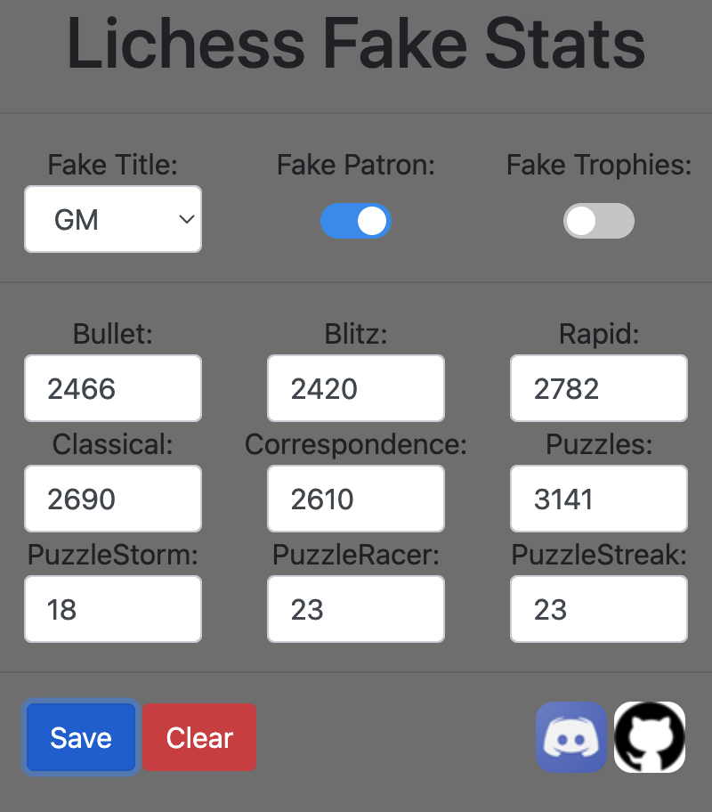

# LichessFakeStats 😎

LichessFakeStats is a Chrome extension that allows you to customize and fake your Lichess profile statistics in various ways. Whether you want to pretend to be a Grandmaster, have a Patron status, or showcase numerous trophies, this extension lets you have fun with your Lichess profile.

🚀 **Features:**

- 🏆 **Fake Titles:** Choose from a range of titles, including GM, IM, FM, CM, LM, WCM, WFM, WIM, and WGM.
- 🎖️ **Fake Patron Status:** Show off your Patron status with a simple toggle.
- 🏅 **Fake Trophies:** Impress others by displaying a collection of trophies.
- 🌟 **Custom Ratings:** Modify your ratings in different game modes, such as Bullet, Blitz, Rapid, Classical, Correspondence, Puzzles, PuzzleStorm, PuzzleRacer, and PuzzleStreak.

## Installation

To install LichessFakeStats, follow these steps:

1. Download the Repository
2. Open Google Chrome and open the URL: [chrome://extensions/](https://chrome://extensions/)
3. Activate developer mode and load the extension.

## Usage

Once the extension is installed, you can easily customize your Lichess profile stats by:

1. Choosing your desired title from the options.
2. Toggling Patron status on or off.
3. Displaying or hiding trophies.
4. Setting custom ratings for various game modes.

Make sure to save your changes to apply them to your Lichess profile.

## Contributions

We welcome contributions to LichessFakeStats! If you'd like to help improve this extension, feel free to:

- Fork the repository.
- Create your branch (`git checkout -b feature/your-feature`).
- Commit your changes (`git commit -m 'Add some feature'`).
- Push to the branch (`git push origin feature/your-feature`).
- Open a pull request.

If you have any recommendations to improve the extension, feel free to contact me on discord.

## Support

If you encounter any issues or have questions about using LichessFakeStats, you can reach out to me via:

- [Discord](https://www.discord.com/users/216163718801653760)
- [GitHub Issues](https://github.com/t0gepi/LichessFakeStats/issues)

## License

This project is licensed under the MIT License - see the [LICENSE.md](LICENSE) file for details.

---

Developed with ❤️ by [t0gepi](https://github.com/t0gepi/)
